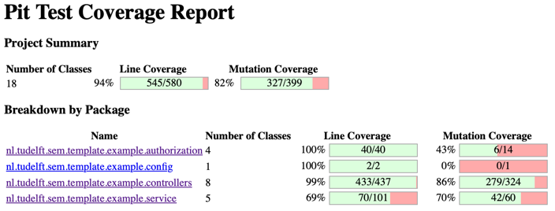
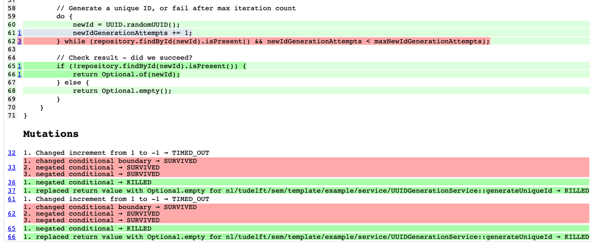
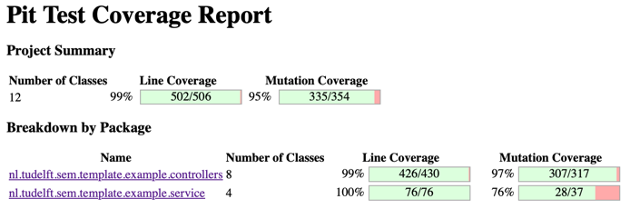
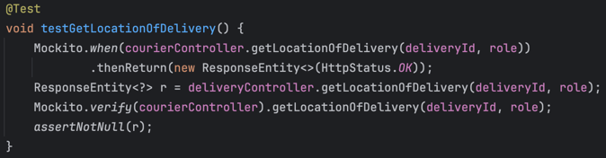
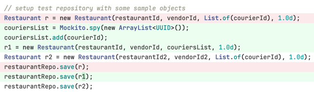

# Part 4: Mutation Testing

## 4.1 Introduction
The mutation testing framework PiTest (/paɪ tɛst/) analyses the robustness of a test suite by injecting faults into the source code. 
If the test suite is able to detect the injected faults, it is considered robust. We use this to analyse the quality of our tests.
In this report we will examine the changes the mutation testing framework made to our code and discuss the results.
## 4.2 Before
#### 4.2.1 Mutation testing report

Figure 1: Project mutation testing report at commit `62d4c2a3cb8f0f9a5408a07a04c281e2ca9b6c7c` [After !52](https://gitlab.ewi.tudelft.nl/cse2115/2023-2024/group-14/team-14b/-/merge_requests/52)
#### 4.2.2 Issues
Looking at the PiTest reports for why the tests failed, we identified the following issues:
1. The Controller Class methods that hold no logic of their own (but instead are a call to a service method) were only tested for the method call, and not the return value. Since PiTest replaces the return value, this wasn't detected.
2. There was a notable lack of edge case coverage. While the suite had nearly full branch coverage, it did so with only the most obvious test cases.
   
    Figure 2: Example of a case where testing with only one element in the list missed the mutation to the `while` conditional.
3. In some cases, especially with setter services, the test didn't assert that the database was correctly updated. 
## 4.3 After
#### 4.3.1 Mutation testing report

Figure 3: Project mutation testing report at HEAD (Relevant MRs: [!53 (mostly)](https://gitlab.ewi.tudelft.nl/cse2115/2023-2024/group-14/team-14b/-/merge_requests/53), [!57](https://gitlab.ewi.tudelft.nl/cse2115/2023-2024/group-14/team-14b/-/merge_requests/57))
#### 4.3.2 Changes
1. By asserting that the Controller was actually returning some output, we eliminated the case that the controller's return value was replaced with null.
    
    Figure 4: Example of a case where testing the return value of the controller method was necessary to detect the mutation.
2. Creating more realistic test cases, for example having multiple deliveries in the repository, or using multiple distinct OffsetDateTime instances, we eliminated a few extra mutations.  Figure 5: Spying on `courierList` to make sure it is used for the appropriate checks.
3. Additional assertions to the database contents made sure it was updated correctly.
4. Refactoring code to simplify conditionals, remove impossible-to-reach checks, and splitting up methods all helped greatly with the codebase's testability, which in turn increased our mutation coverage; without us actually using the report to guide testing.
5. We removed configuration classes from the coverage.

## 4.4 Conclusion
Mutation testing helped guide our testing efforts, and served as a great benchmark for the work we've done. 
It clearly highlighted tests that were not quite doing their job, but also helped us see where we can generally improve our testing.

## 4.5 Future work
Getting Mutation Coverage to 100% is very doable, but currently unnecessary, and not very beneficial. A lot of the mutations do not represent realistic scenarios, and any test that would handle them would not really serve any purpose other than to increase the mutation coverage.
The only class that we still want to test is UUIDGenerationService, since it is not very well tested as of now.
